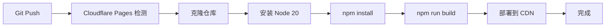

# Cloudflare Pages 构建配置

## 🔧 构建设置

在 Cloudflare Pages Dashboard 中配置：

### **Framework preset**
```
Next.js (Static HTML Export)
```

### **Build command**
```bash
npm run build
```

### **Build output directory**
```
out
```

### **Root directory** (optional)
```
/
```

---

## 📦 环境变量配置

### **必需环境变量（多租户模式）**

```bash
# 启用 Worker API
NEXT_PUBLIC_USE_CUSTOM_API=true

# Worker API 端点
NEXT_PUBLIC_WORKER_API=https://notionnext-api.YOUR_USERNAME.workers.dev
```

### **可选环境变量**

```bash
# 固定租户 ID（单租户部署到多租户系统）
NEXT_PUBLIC_TENANT_ID=my-tenant

# API 认证
NEXT_PUBLIC_API_KEY=your-secret-key

# 主题配置
NEXT_PUBLIC_THEME=heo

# 语言配置
NEXT_PUBLIC_LANG=zh-CN

# 站点信息
NEXT_PUBLIC_AUTHOR=NotionNext
NEXT_PUBLIC_BIO=我的博客
NEXT_PUBLIC_LINK=https://yourdomain.com
```

### **降级备份（传统单租户模式）**

如果不使用 Worker API，需要配置：

```bash
# Notion 页面 ID
NOTION_PAGE_ID=your-notion-page-id

# 可选：Notion API 配置
API_BASE_URL=https://www.notion.so/api/v3
```

---

## 🚀 Node 版本

项目使用 Node.js 20.x，已在以下文件配置：

- `.nvmrc`: `20`
- `package.json`: `"engines": { "node": ">=20" }`

Cloudflare Pages 会自动检测并使用正确的 Node 版本。

---

## 📝 构建命令说明

### `npm run build`
执行 Next.js 静态导出构建：
```bash
cross-env BUILD_MODE=true next build
```

这会：
1. 设置 `BUILD_MODE=true` 环境变量
2. 执行 Next.js 生产构建
3. 生成静态 HTML 文件到 `out/` 目录

---

## ⚠️ 常见问题

### Q: 构建失败 "The lockfile would have been modified"
**A:** 已修复！现在使用 npm 和 `package-lock.json`，不再使用 Yarn。

### Q: 构建超时
**A:** 调整环境变量 `NEXT_REVALIDATE_SECOND` 增加缓存时间，减少 Notion API 调用：
```bash
NEXT_PUBLIC_REVALIDATE_SECOND=3600  # 1小时缓存
```

### Q: Out of memory
**A:** 在 Cloudflare Pages 设置中增加构建内存（需要 Workers Paid 计划）

### Q: 找不到模块
**A:** 确保所有依赖都在 `package.json` 的 `dependencies` 中，而不是 `devDependencies`

---

## 🔄 CI/CD 流程



### 自动部署分支
- **Production**: `main` 分支
- **Preview**: 所有 Pull Requests 和其他分支

---

## 📊 构建优化建议

### 1. 启用缓存
```bash
# 增加页面缓存时间
NEXT_PUBLIC_REVALIDATE_SECOND=1800  # 30分钟
```

### 2. 压缩图片
```bash
# 启用图片压缩
NEXT_PUBLIC_IMAGE_COMPRESS_WIDTH=800
```

### 3. 减少构建依赖
移除不必要的 devDependencies，减少安装时间。

### 4. 使用环境特定配置
```bash
# 生产环境禁用调试
NEXT_PUBLIC_DEBUG=false
```

---

## 🎯 部署 Checklist

- [ ] 推送代码到 GitHub
- [ ] 在 Cloudflare Pages 连接仓库
- [ ] 设置构建命令: `npm run build`
- [ ] 设置输出目录: `out`
- [ ] 配置环境变量
- [ ] 触发第一次构建
- [ ] 验证部署成功
- [ ] 配置自定义域名（可选）
- [ ] 设置 Preview 分支（可选）

---

## 🔗 相关文档

- [Next.js 静态导出](https://nextjs.org/docs/pages/building-your-application/deploying/static-exports)
- [Cloudflare Pages 文档](https://developers.cloudflare.com/pages/)
- [多租户部署指南](./MULTI_TENANT_DEPLOYMENT.md)
